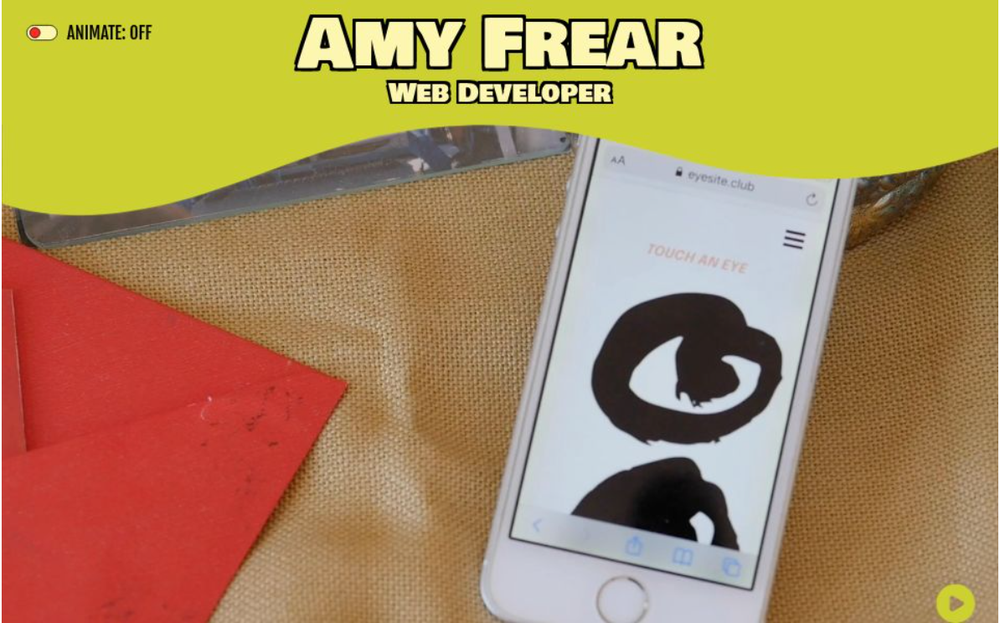

# Amy Frear's Portfolio

A portfolio website built with Next.js and React, with a focus on performance, accessibility, and a fun user experience.



**Live Site**: [frear-projects.com](https://www.frear-projects.com/)

## Overview

This is a single-page portfolio application featuring:

- **Smooth animations** with reduced motion support for accessibility
- **Responsive design** that works seamlessly on mobile and desktop
- **Interactive video background** with Vimeo integration
- **Feature flags** for progressive feature rollout
- **Custom parallax effects** for visual depth

## Tech Stack

- **Framework**: Next.js 16 (with Turbopack)
- **React**: 19.2
- **Styling**: styled-components with native Next.js compiler support
- **State Management**: React Context API
- **Animation**: motion/react
- **Deployment**: Vercel

## Features

### Accessibility

- **Reduced Motion Support**: Detects user's system preference and disables animations for users who prefer reduced motion. Reduced Motion toggle to control on site.
- **Semantic HTML**: Proper heading hierarchy and ARIA labels
- **Keyboard Navigation**: Full keyboard support throughout the site
- **Screen Reader Friendly**: Hidden text labels for icon-only elements

### Performance

- Static generation with Next.js
- Optimized image loading
- CSS-in-JS with proper server-side rendering
- Feature flags to reduce bundle size

## Project Structure

```
├── components/          # React components
│   ├── icons/          # SVG icon components
│   ├── Header.js       # Desktop header
│   ├── HeaderMobile.js # Mobile header
│   ├── FrontPage.js    # Hero section
│   ├── Intro.js        # Introduction with parallax
│   ├── About.js        # About section
│   ├── Projects.js     # Personal projects showcase
│   ├── Work.js         # Professional work experience
│   ├── Contact.js      # Contact information
│   └── VideoBG.js      # Vimeo video background
├── context/            # React Context providers
│   └── context.js      # ReducedMotionContext
├── hooks/              # Custom React hooks
│   └── useParallax.js  # Parallax scroll effect hook
├── pages/              # Next.js pages
│   ├── index.js        # Home page (main entry point)
│   ├── _app.js         # App wrapper
│   └── api/            # API routes
├── styles/             # Global styles and utilities
│   ├── colors.js       # Color palette
│   ├── typography.js   # Reusable typography styles
│   └── breakpoints.js  # Responsive breakpoints
└── config/             # Configuration
    └── featureFlags.js # Feature flag management
```

## Getting Started

### Prerequisites

- Node.js 14+
- npm or yarn

### Installation

```bash
# Clone the repository
git clone <repository-url>

# Install dependencies
npm install

# Start development server
npm run dev
```

The site will be available at [http://localhost:3000](http://localhost:3000)

## Development

### Available Scripts

```bash
# Start development server
npm run dev

# Build for production
npm run build

# Start production server
npm start

# Run linter
npm run lint
```

### Code Style

This project uses:

- **ESLint** for code quality
- **Prettier** for code formatting
- Configured with Next.js recommended settings

All code is automatically formatted on save. Run `npm run lint` to check for issues.

## Architecture Decisions

### State Management: React Context

The `ReducedMotionContext` manages animation preferences globally.

### Styling: styled-components

Chose styled-components for:

- Scoped styling
- Dynamic styles based on props
- Server-side rendering support
- Component-co-located styles

### Custom Hooks

The `useParallax` hook encapsulates parallax scroll logic, making it reusable and testable.

### Feature Flags

Implemented feature flags for progressive feature rollout without deployments:

- `SHOW_ANIMATION_TOGGLE` - Toggle animation preference UI
- `SHOW_SIDENAV` - Show/hide side navigation menu

## Accessibility

### Reduced Motion Support

The entire site respects the user's system preference for `prefers-reduced-motion`. When enabled major animations are disabled, parallax is disabled, and autoplay is turned off for video.

### Implementation

```javascript
// Uses Context API to provide animation state globally
const { animation } = useContext(ReducedMotionContext);

// Components conditionally render animations based on preference
{
  animation && <AnimatedComponent />;
}
```

## Performance Optimizations

- **CSS-in-JS SSR**: Styled-components configured for server-side rendering
- **Feature Flags**: Unused features can be disabled to reduce code

## Video Credit

The video used in the ambient header was made by me in homage to the experimental videos [Les Mains by Geta Brătescu](https://vimeo.com/132207733) and [I'm too sad to tell you by Bas Jan Ader](https://www.youtube.com/watch?v=zAsRpwsQqYQ)... and a very fun project I made when I first learned to code called EYE SITE. You can see more of my video work on [Vimeo](https://vimeo.com/amyfrear).

## Contact

- **Email**: [amy.frear@gmail.com](mailto:amy.frear@gmail.com)
- **LinkedIn**: [linkedin.com/in/amy-frear](https://www.linkedin.com/in/amy-frear)
- **GitHub**: [github.com/a-frear](https://github.com/a-frear)

---

Thanks for checking out my portfolio! 👽 Amy
